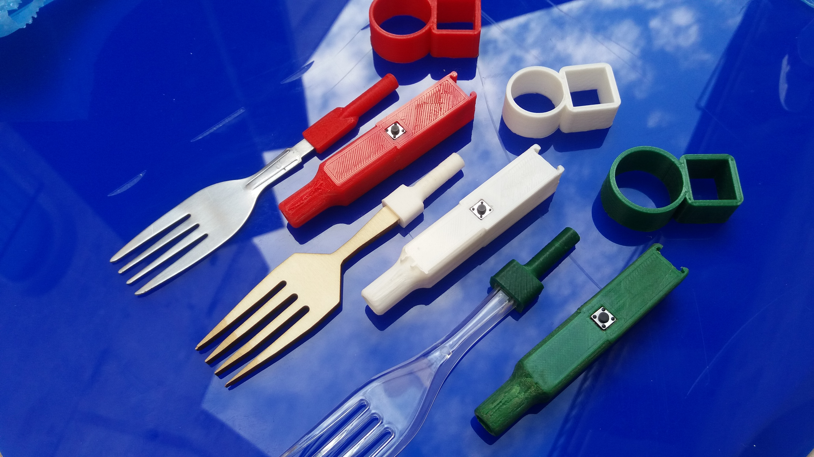
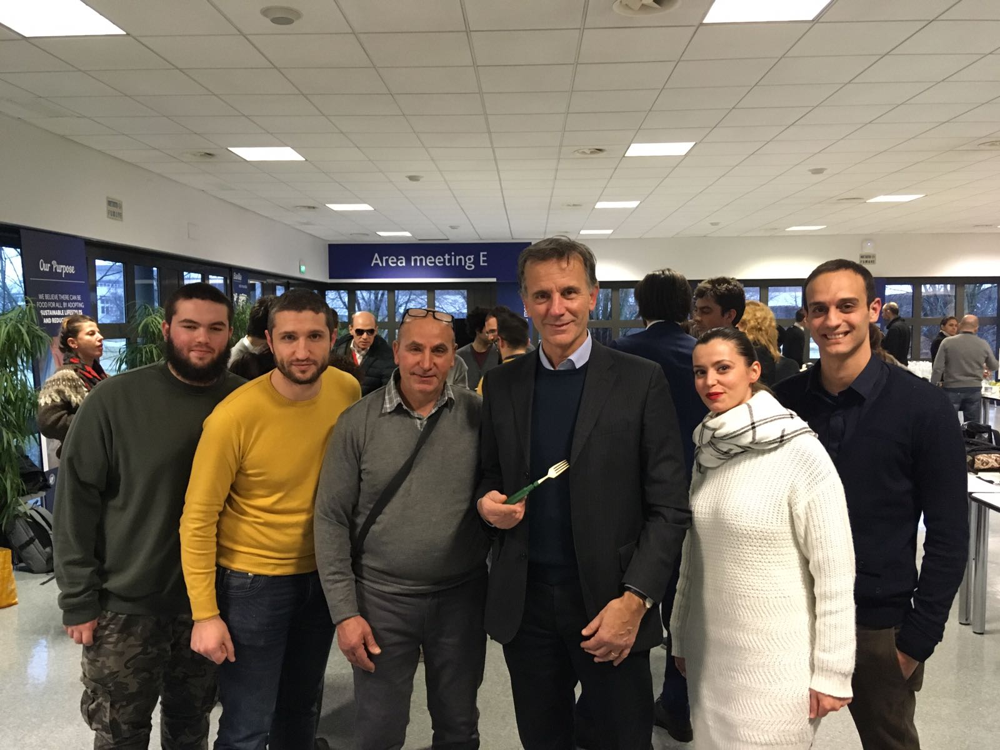
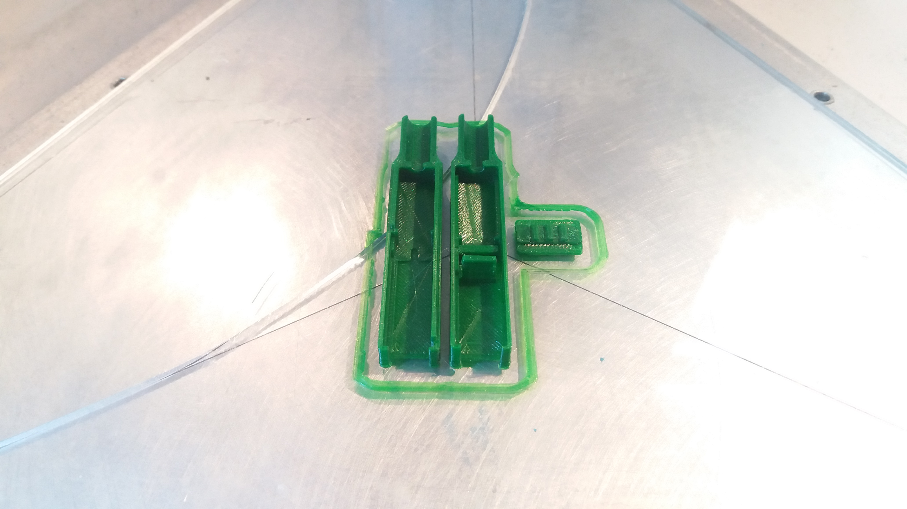
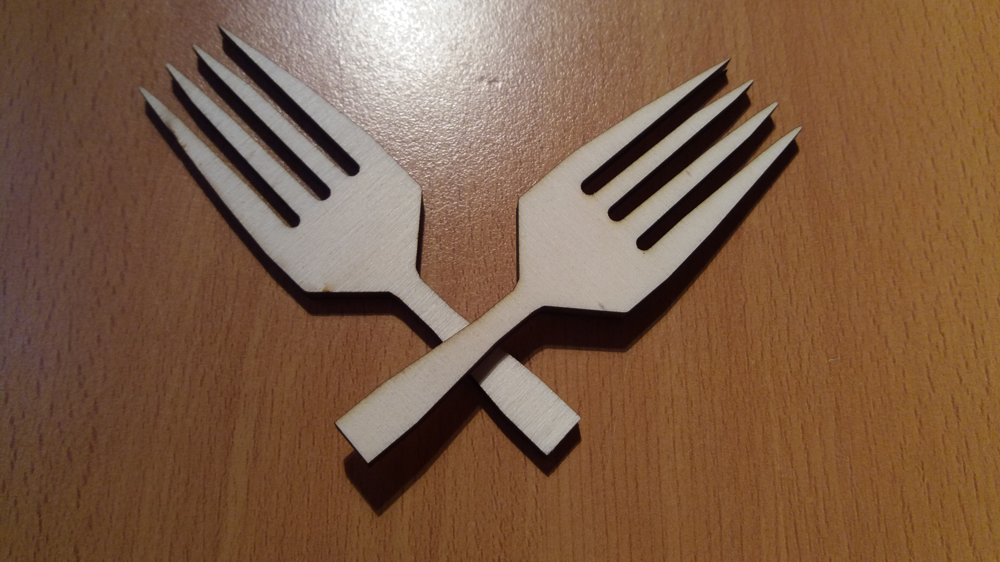
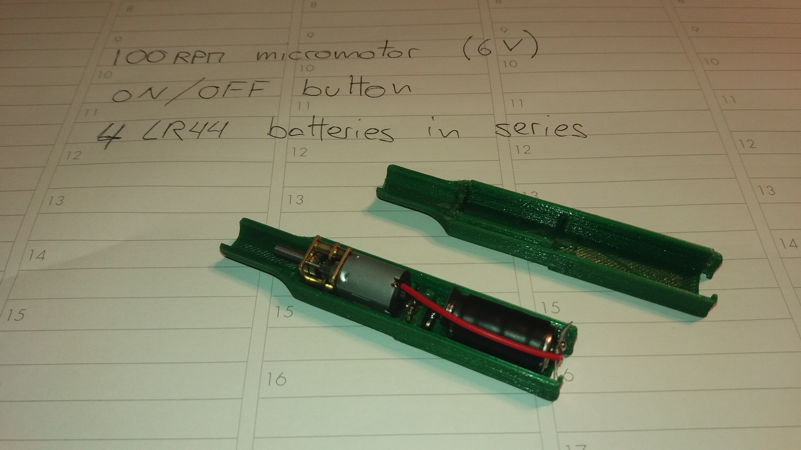
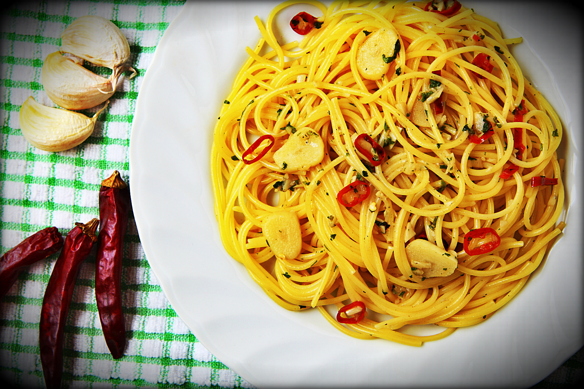
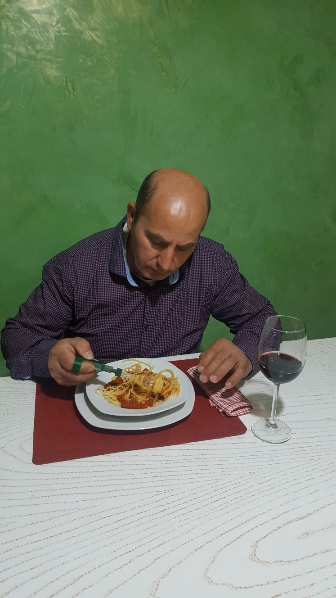
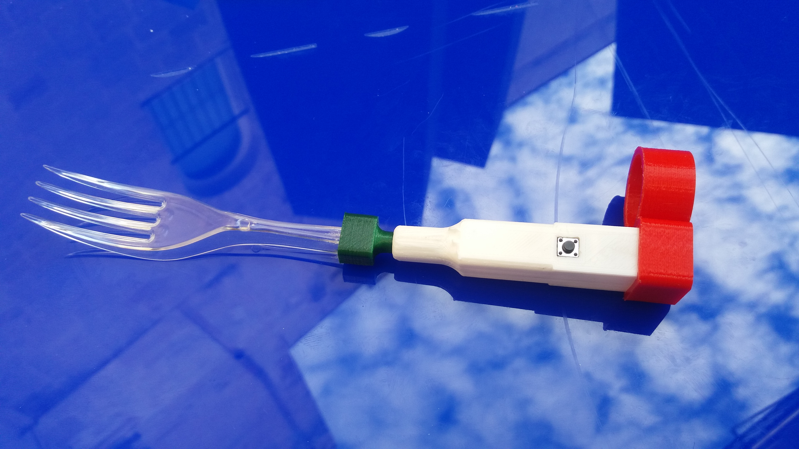
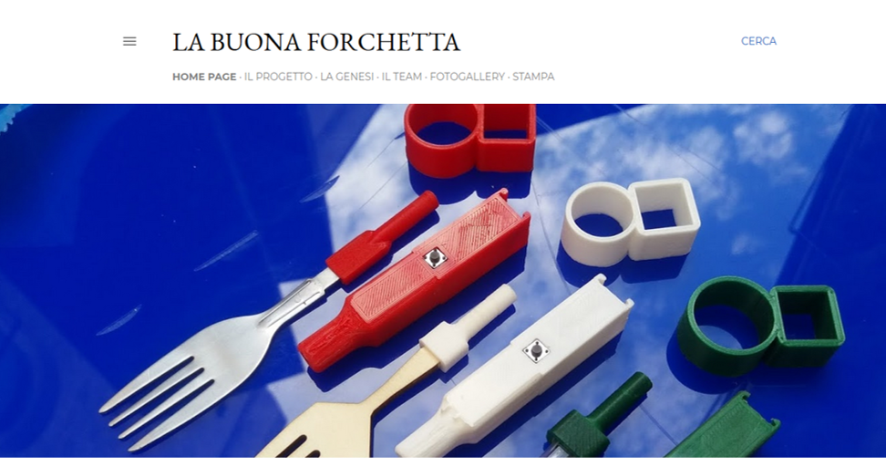

# La Buona Forchetta - Hackability@Barilla

## What it is
La Buona Forchetta is a miniaturized device that allows the rotation of fork tips conceived disposable in PLA 3D printed, in 

wood cut with laser, in plastic for food obtained from forks already on the market (for sustainability even in the absence 

of a Fablab) and one in steel for domestic use.

It has specific accommodations for each of the above mentioned points to allow interchange. The device can also be inserted 

into a support which includes a ring which prevents loss during a tremor.

The extremely small size compared to the devices on the market allow you to hide it under your finger or carry it in your 

jacket pocket.

## Who we are
* Giulio De Riccardis;
* Domenico Barbarito;
* Claudia Barbarito;
* Giuliano De Pascali;
* Ilaria Pellegrino;
* Cristiano Maci;
* Luca Ciccarese;
* Alessio Pecoraro.

The Barilla CEO (center) likes La Buona Forchetta!

## Need we faced

Domenico, a member of the team, suffers from Parkinson's disease. He asked us for a miniaturize device to make him taste 

a plate of spaghetti! 

Parkinson's is a chronic neurodegenerative disease that most commonly occurs in the elderly over the age of 50. The 

characteristic symptoms of the disease - tremor, rigidity, bradykinesia and postural instability - are due to the death of 

the cells responsible for the synthesis of dopamine - neurotransmitter essential for brain metabolism. One of the obvious 

and disabling symptoms of patients suffering from the disease is the difficulty in handling objects, such as rotating a fork 

between the fingers while eating a plate of spaghetti.

## How we dealt with it
After a first confrontation with Domenico we performed a patent and market analysis, discovering the 

great limits of the devices on the market: 

* aesthetically uncomfortable because they are too conspicuous; 
* with a single non-disposable metal tip that entails hygiene problems when used outside the home; 
* of excessive shape and size to be portable; 
* not customizable and without anti-fall safety devices. 

Following a brainstorming, a first prototype was developed that has undergone numerous changes and improvements in this 

month until it reached the final version discussed here.

## The prototype
The case, the accommodations for the fork tips and the support have been designed using DS SolidWorks.

After being converted to .stl files, they have been 3D printed using a WASP Delta 2040.

The wood fork tip (4mm multi-layer poplar) has been cut with a HSG S1390 laser cutter.

The circuit is composed by:

* 1x DC 6V micromotor
* 1x ON/OFF button
* 4x LR44 batteries

## Spaghetti Recipe
Spaghetti with garlic, oil, chilli and tomatoes Recipe.

Ingredients:
1. Spaghetti strictly Barilla (100g);
2. Garlic, Oil, Chilli, Cherry tomatoes;
3. La Buona Forchetta.

Recipe:
1. Brown garlic, oil, chilli and tomatoes in a pan;
2. Cook the Barilla spaghetti al dente and finish cooking over high heat in the pan with the sauce;
3. Enjoy the dish by helping you with La Buona Forchetta!

Spaghetti Recipe Video at: https://youtu.be/GTm76VhDWDo

## Test with Domenico
Domenico tests La Buona Forchetta, eating spaghetti with tomato sauce!

Spaghetti Test Video with Domenico at: https://youtu.be/BDgRXz7n8F4

## SPOT 

Look the SPOT Video at: https://youtu.be/gAKzE_MczW0

## Website
The prototype is accompanied by a portal whose aim is to keep the project alive and make it self-sufficient. 
We want to give patients with Parkinson's disease besides Domenico the right to request a sample or any modifications and customizations; to makers and Fablabs to download the files, make these changes and create the prototype to provide it for free.

Follow us on:

Website https://la-buona-forchetta.blogspot.it/

Facebook https://www.facebook.com/buonaforchetta.info/

Instagram https://www.instagram.com/labuonaforchetta_official

## Presentation
You can find and download the presentation in pdf of the project [here](presentation/Presentation.pdf). 

## License
All the material is available under the terms of the CC BY-SA 4.0 license (Creative Commons Attribution-ShareAlike 4.0 

International License). 
